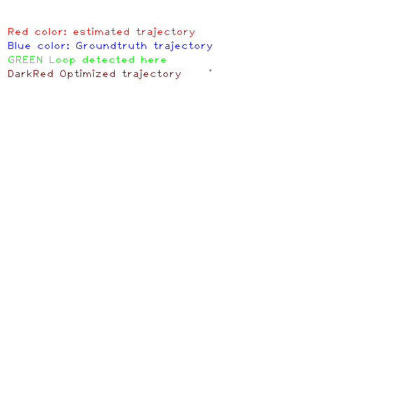

# VO-with-Loop-Clousre-Detector
=============

##Overview
This is the simple implementation for the stereo vo with loop closure detection and subsequent bundle adjustment optimization.

DLoopDetector requires [DLib](https://github.com/dorian3d/)
Bag of Word model is used for place recognition [DBoW2](https://github.com/dorian3d/DBoW2).

ORB feature extractor for feature extraction and the vocabulary is from ORBSLAM2.

When running bundle adjustment after loop detection, instead of running global, local with the most recent frames are used.

### Requirement
* OpenCV 3.2
* Kitti data 00 visual odometry [Kitty](http://www.cvlibs.net/datasets/kitti/eval_odometry.php)
* g2o optimizaiton package
* DBow2 and DLoop Detector for Loop closure detection 

## Directories
Parallel folder is to create separate threads for different task, such as optimization, visualization.

network folder is to use client server model, client process for computation, then send data to server process for visualization. So we can separate the client and server process on different machines.

## Install and usage notes
install g2o and opencv, for the other dependences, the files are included in the third party folder, run ./build.sh to run and execute the files, the test images are in the image folder, so you can use them to start!

Final trajectory after completing all the images.
